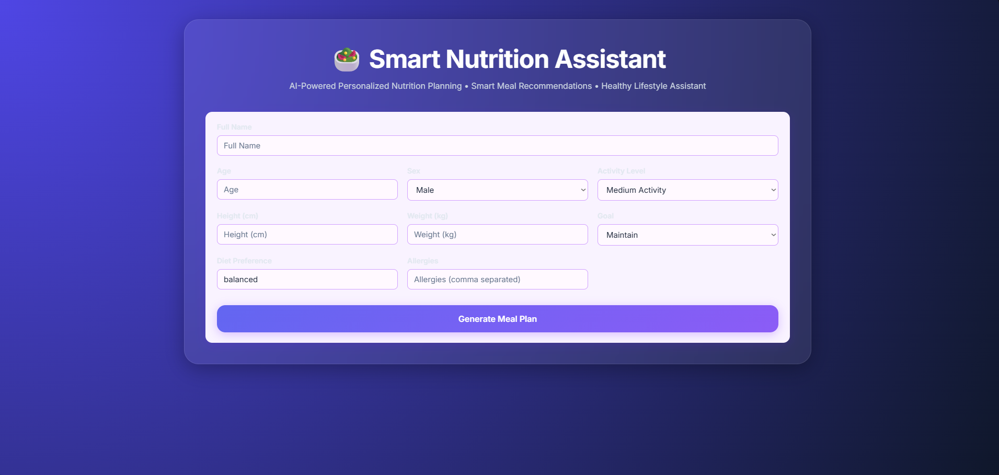
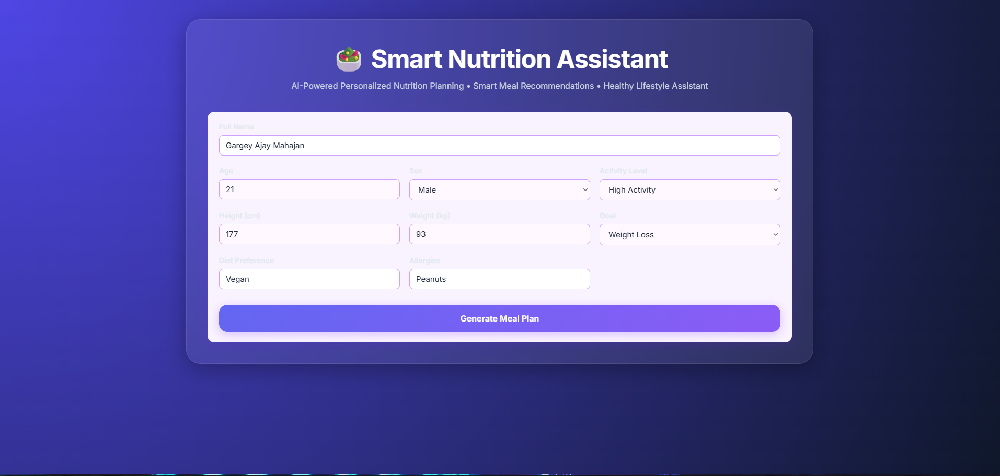
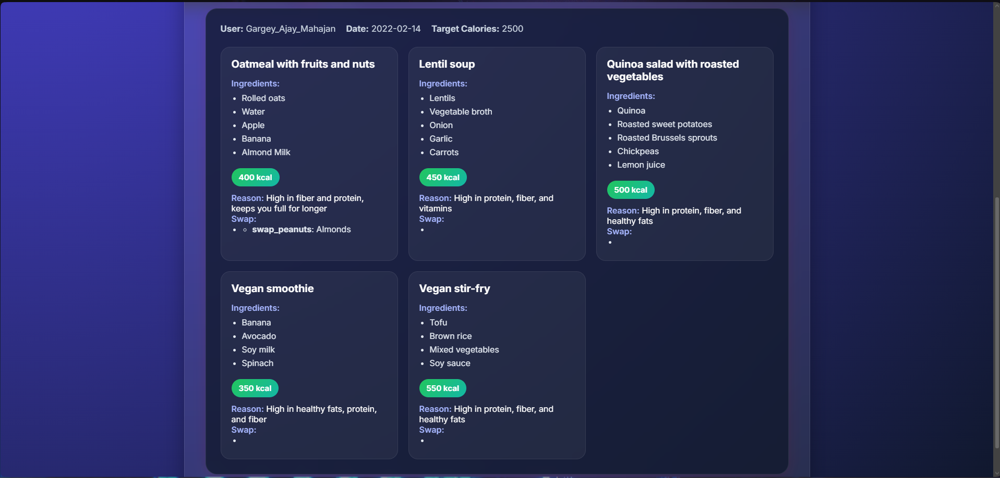
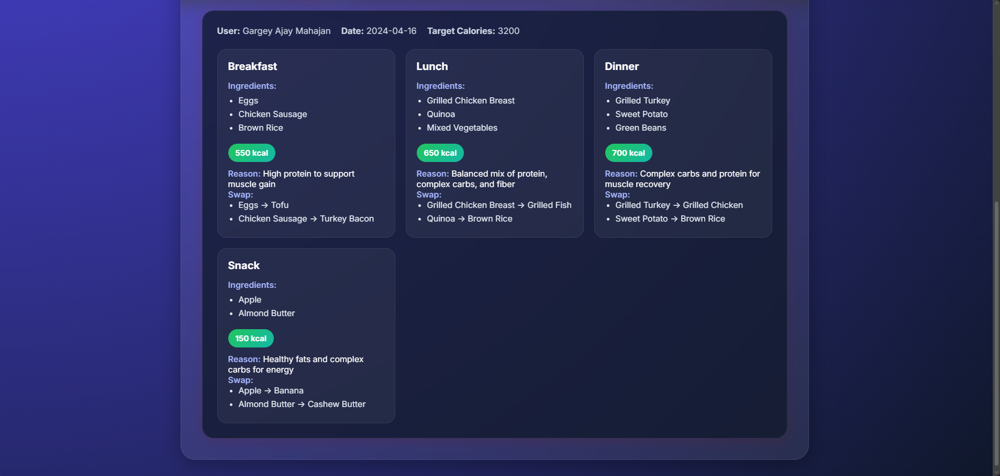

# 🥗 Smart Nutrition Assistant

An AI-powered nutrition planning application that generates personalized meal plans based on a user's profile, fitness goals, dietary preferences, and allergies.

Built using:

- React.js
- FastAPI
- IBM Watsonx AI / LLM Integration
- Modern Responsive UI
- REST API Architecture

---

## 🚀 Features

✅ Personalized meal plans

✅ Supports multiple fitness goals:
- Weight Loss
- Muscle Gain
- Maintenance

✅ Diet preferences:
- Vegetarian
- Vegan
- Non-Vegetarian
- Balanced Diet

✅ Allergy-aware meal recommendations

✅ AI-generated meal suggestions

✅ Responsive modern glassmorphism UI

✅ FastAPI backend

---

# 📸 Screenshots

## Home Screen



---

## User Input Form



---

## Meal Plan Generation



---

## Muscle Gain Meal Plan


---

## Responsive Modern UI



---

# 🏗️ Project Architecture

```text
Smart-Nutrition-Assistant
│
├── frontend
│   ├── React
│   ├── CSS
│   └── API Integration
│
├── backend
│   ├── FastAPI
│   ├── Watsonx AI Integration
│   └── Meal Plan Generation Logic
│
└── README.md
```

---

# ⚙️ Installation

## Clone Repository

```bash
git clone https://github.com/yourusername/smart-nutrition-assistant.git

cd smart-nutrition-assistant
```

---

# Backend Setup

## Create Virtual Environment

```bash
python -m venv venv
```

### Windows

```bash
venv\Scripts\activate
```

### Linux / Mac

```bash
source venv/bin/activate
```

---

## Install Dependencies

```bash
pip install fastapi uvicorn python-dotenv ibm-watsonx-ai
```

---

## Configure Environment Variables

Create a `.env` file:

```env
WATSONX_API_KEY=YOUR_API_KEY
WATSONX_PROJECT_ID=YOUR_PROJECT_ID
WATSONX_URL=https://us-south.ml.cloud.ibm.com
```

---

## Run Backend

```bash
uvicorn backend:app --reload
```

Backend runs at:

```text
http://127.0.0.1:8000
```

---

# Frontend Setup

Install dependencies:

```bash
npm install
```

Start frontend:

```bash
npm start
```

or

```bash
npm run dev
```

Frontend runs at:

```text
http://localhost:1234
```

---

# API Endpoint

## Generate Meal Plan

### Request

```http
POST /generate_plan
```

### Sample Request

```json
{
  "name": "John Doe",
  "age": 25,
  "sex": "male",
  "height_cm": 177,
  "weight_kg": 93,
  "activity": "high",
  "goal": "muscle_gain",
  "diet": "non vegetarian",
  "allergies": ["milk"]
}
```

---

# Example Output

```json
{
  "target_calories": 3200,
  "meals": [
    {
      "name": "Breakfast",
      "approx_calories": 550
    },
    {
      "name": "Lunch",
      "approx_calories": 650
    },
    {
      "name": "Dinner",
      "approx_calories": 700
    }
  ]
}
```

---

# Future Improvements

- BMI Calculator
- Nutrition Charts
- Progress Tracking
- PDF Meal Plan Export
- Authentication System
- User Dashboard
- Meal History Storage
- Mobile App Version

---

# Tech Stack

| Technology | Usage |
|------------|--------|
| React | Frontend |
| FastAPI | Backend |
| IBM Watsonx AI | AI Meal Generation |
| CSS3 | UI Styling |
| REST API | Communication |

---

# Author

**Gargey Mahajan**

Computer Engineering Student

LinkedIn:
(Add your LinkedIn URL here)

---

# License

This project is licensed under the MIT License.
